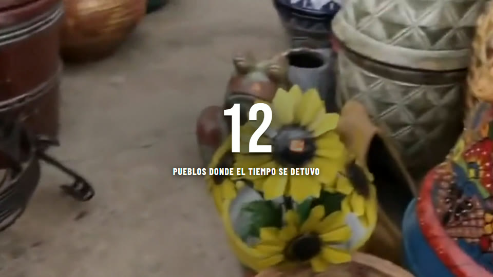
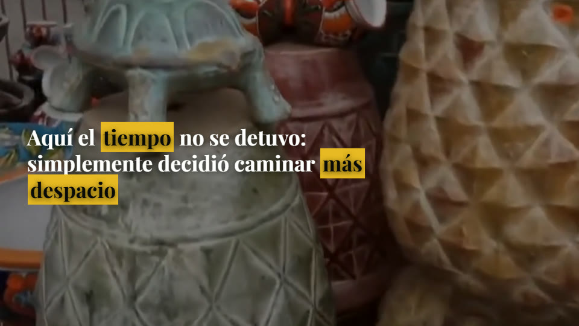
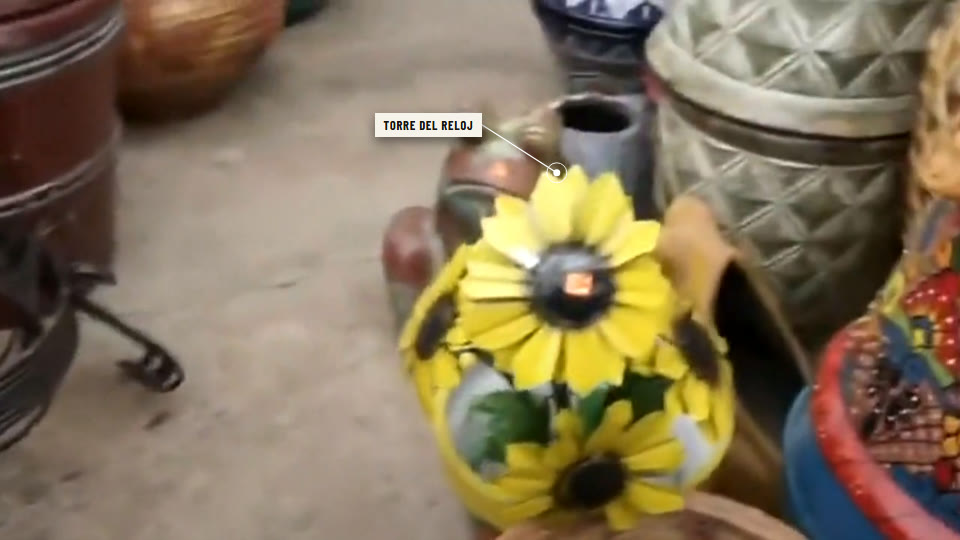
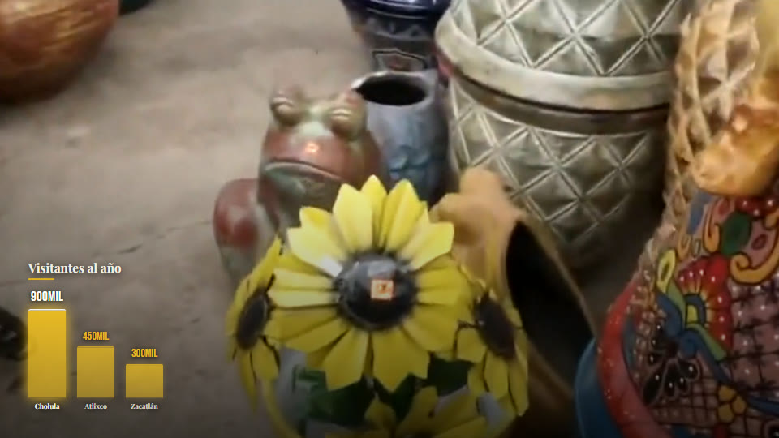
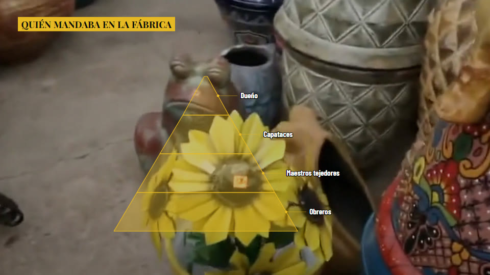
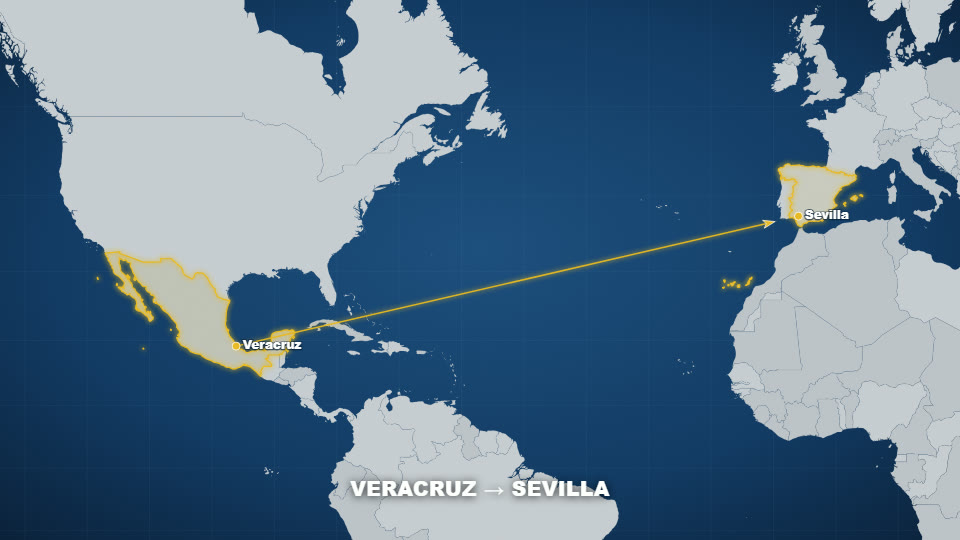
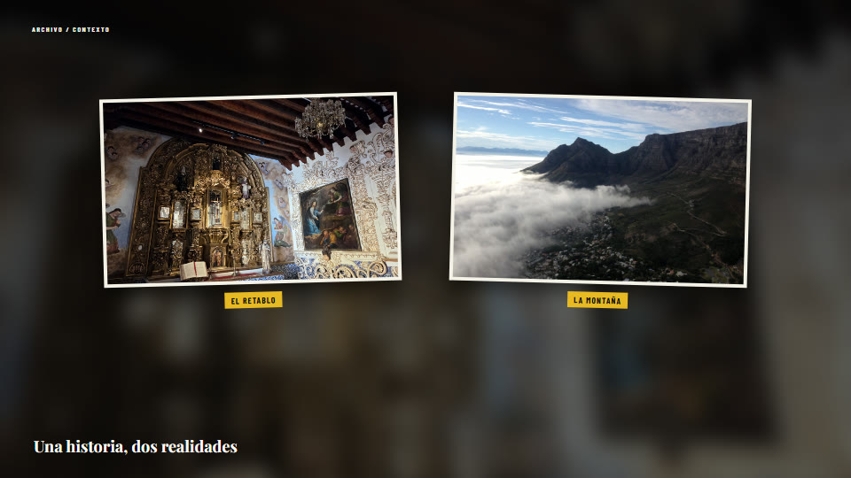
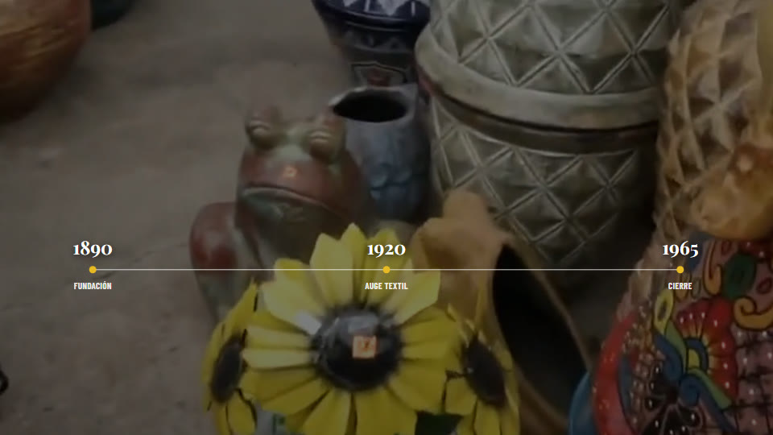

# Motion-Graphics

Plantillas de **motion graphics documentales** hechas con [Remotion](https://www.remotion.dev/) (React + TypeScript): cifras, fechas, títulos, frases resaltadas, etiquetas sobre el plano, esquemas, gráficas, mapas vectoriales y composiciones editoriales a pantalla completa.

Son las mismas plantillas que usamos en producción en nuestro pipeline de vídeo (estilo "VidRush" / documental). Todo se controla con **un JSON de eventos**: cada evento dice qué plantilla, cuándo aparece, cuánto dura y qué texto lleva. Remotion dibuja los overlays encima de tu vídeo de fondo.

<p align="center">









</p>

🎬 **Showcase (20 s, 1280×720):** [`examples/showcase.mp4`](examples/showcase.mp4), con sus props en [`examples/showcase.json`](examples/showcase.json).

---

## Instalación

Requisitos: Node.js 18 o superior (probado con Remotion 4.0.477).

```bash
npm install
npx remotion studio src/index.tsx     # o: npm run studio
```

En el Studio verás tres composiciones:

| Composición | Para qué sirve |
| --- | --- |
| `PipelineMotion` | **La principal.** Vídeo de fondo + lista de eventos (props). Es la que se renderiza en producción. |
| `GeoMapDemo` | Demo del mapa vectorial (d3-geo + world-atlas): países teñidos, bandera, ruta y marcador. |
| `VidrushReferenceStudy` | Carrusel de las 8 composiciones editoriales `vidrush_*` para revisar timing y jerarquía. |

Para probar un ejemplo en el Studio, pega el contenido de cualquier `examples/props/*.json` en el panel de props de `PipelineMotion`.

## Cómo renderizar

```bash
# Vídeo completo con tus props
npx remotion render src/index.tsx PipelineMotion out/video.mp4 --props=examples/showcase.json

# Un fotograma suelto (PNG)
npx remotion still src/index.tsx PipelineMotion out/chart.png --props=examples/props/chart.json --frame=110

# Regenerar TODOS los ejemplos del repo (stills + showcase) con un único bundle
npm run examples                    # = node scripts/render-examples.mjs
node scripts/render-examples.mjs stills chart pyramid   # solo algunas
```

Consejos:

- Los ficheros locales (vídeo de fondo, fotos, banderas) van en `public/` y se referencian por **ruta relativa** (`"image": "mi_foto.jpg"`). También valen URLs `https://…`. Chromium **no** carga `file://`.
- Las composiciones están diseñadas a **1920×1080 / 30 fps**. Para otra salida usa `--scale` (p. ej. `--scale=0.6667` → 1280×720).
- En máquinas cargadas: `--concurrency=1`.

---

## Esquema de props / eventos

```jsonc
{
  "videoSrc": "demo_footage.mp4",   // vídeo de fondo (en public/ o URL)
  "width": 1920, "height": 1080, "fps": 30,
  "durationSeconds": 20,            // duración total de la composición
  "style": "mid",                   // low | mid | high (densidad; informativo)
  "events": [
    {
      "id": "e1",                   // único
      "type": "stat_big",           // plantilla (ver tabla)
      "start": 0.3,                 // segundo en que entra
      "duration": 3.0,              // segundos en pantalla
      "title": "12",                // texto principal
      "subtitle": "PUEBLOS DONDE EL TIEMPO SE DETUVO",
      "accent": "#e8b923",          // color de acento
      "docStyle": true,             // gramática documental (ver abajo)
      "lang": "es"                  // idioma de los rótulos fijos (es/en/pt/fr/it/de)
    }
  ]
}
```

Campos por evento (todos opcionales salvo `id`, `type`, `start`, `duration`):

| Campo | Tipo | Uso |
| --- | --- | --- |
| `title` | string | Texto principal: cifra, fecha, nombre, frase o conclusión. |
| `subtitle` | string | Pie / explicación corta. |
| `kicker` | string | Antetítulo, fuente de una cita o etiqueta secundaria. |
| `items` | string[] | Listas, niveles, hitos (`"1890: Fundación"`), barras (`"Cholula: 900 mil"`), palabras a resaltar (`narrative_text`), trozos (`kinetic_words`), origen/destino. |
| `accent` | color CSS | Color de acento del evento. |
| `theme` | string | Tema tipográfico: `documentary`, `history`, `crime`, `truecrime`, `geography`, `modern`, `minimal`, `standard`, `military`, `nature`, `science`, `business`… |
| `font` | CSS font-family | Fuerza una tipografía (si no, la del tema). |
| `docStyle` | bool | **Gramática documental**: `stat_big` → cifra enorme blanca centrada; `section_title`/`title_full` → barra de capítulo; `lower_third` → etiqueta de papel. Es lo que usa el estilo HQ IA Mix. |
| `side` | `left`\|`right`\|`center` | Lado para etiquetas y paneles. |
| `rank` | number | Puesto de ranking (`rank_badge`, `photo_strip`). |
| `image`, `image2` | ruta/URL | Fotos para las plantillas editoriales (el fondo desenfocado sale de `image`). |
| `targetX`, `targetY` | 0..1 | Punto del plano al que señala `callout_label`, `vidrush_inspector_lens`, `doc_highlight`. |
| `box` | `[x1,y1,x2,y2]` 0..1 | Zona que encuadra `frame_box`. |
| `targets` | `[[x,y],…]` 0..1 | Posición de cada pieza en `parts_diagram`. |
| `chartKind` | `bars`\|`line` | Forma de `chart` (`line` = serie de años). |
| `schematicKind` | string | Geometría de `engineering_schematic`: `floor_plan`, `column_section`, `facade_section`, `foundation_section`, `tower_compare`, `site_plan`… |
| `revealSeconds` | number | `narrative_text`: segundos que tarda la voz en decir la frase (se escribe a ese ritmo). |
| `focusName` | string | Mapas: país a enfocar (nombre en inglés de world-atlas, p. ej. `"Mexico"`). |
| `highlight` | `[{name,color,flag?}]` | Mapas: países teñidos (+ bandera opcional en `public/`). |
| `markers` | `[{lon,lat,label?,color?}]` | Mapas: pines. |
| `geoRoute` | `{fromLon,fromLat,toLon,toLat,color?,strike?}` | Mapas: ruta animada (`strike` = cazas). |
| `locName` | string | Mapas: rótulo de la localización. |

Reglas que aplican las propias plantillas (para no inventar datos en pantalla):

- `chart` necesita **≥2 valores reales** en `items` con formato `"Etiqueta: número unidad"`; si no, cae a un rótulo simple. `vox_chart` necesita ≥3.
- `pyramid` necesita ≥2 niveles reales.
- Las composiciones `vidrush_*` necesitan foto real (`image`, y `image2` en matriz/galería). `scripts/validate-vidrush-events.mjs` comprueba unos props antes de renderizar.
- Si hay datos geográficos (`focusName`/`highlight`/`markers`/`geoRoute`), `map_route` y `map_zoom` usan el mapa vectorial.

---

## Plantillas

⭐ = subconjunto que usamos en nuestro estilo **"HQ IA Mix"** (overlays limpios sobre la imagen con `docStyle: true`, más gráficas, pirámide y mapas). `map_zoom` lo inserta el pipeline automáticamente la primera vez que la narración menciona un lugar nuevo.

"Overlay" = se dibuja sobre el vídeo, que sigue viéndose. "Pantalla completa" = la composición tapa el vídeo con su propio fondo (en producción: como mucho ~12 % de las escenas y nunca dos en menos de 30 s).

### Texto centrado

| Plantilla | `type` | Qué hace | Pantalla | Ejemplo |
| --- | --- | --- | --- | --- |
| **stat_big** ⭐ | `stat_big` | Cifra enorme centrada que cuenta hacia arriba + pie en mayúsculas. | Overlay sobre el metraje | [JPG](examples/stills/stat_big.jpg) · [props](examples/props/stat_big.json) |
| **echo_title** ⭐ | `echo_title` | Título serif con eco/repetición detrás (tono crónica / true crime). | Overlay sobre el metraje | [JPG](examples/stills/echo_title.jpg) · [props](examples/props/echo_title.json) |
| **narrative_text** ⭐ | `narrative_text` | Frase que se escribe al ritmo de la voz con 1-3 palabras clave resaltadas. | Overlay sobre el metraje | [JPG](examples/stills/narrative_text.jpg) · [props](examples/props/narrative_text.json) |
| **kinetic_words** ⭐ | `kinetic_words` | Frase partida en 3-4 trozos a distintos tamaños (máx. 1 por vídeo). | Overlay sobre el metraje | [JPG](examples/stills/kinetic_words.jpg) · [props](examples/props/kinetic_words.json) |
| **center_label** ⭐ | `center_label` | Etiqueta pequeña centrada abajo que nombra lo que se ve. | Overlay sobre el metraje | [JPG](examples/stills/center_label.jpg) · [props](examples/props/center_label.json) |
| **stamp_word** | `stamp_word` | Una palabra gigante sobre panel de acento: golpe dramático. | Overlay sobre el metraje | [JPG](examples/stills/stamp_word.jpg) · [props](examples/props/stamp_word.json) |
| **glitch_number** | `glitch_number` | Cifra/año muy corto con efecto glitch. | Overlay sobre el metraje | [JPG](examples/stills/glitch_number.jpg) · [props](examples/props/glitch_number.json) |
| **ticker_word** | `ticker_word` | Titular rojo que se desliza sobre negro (prensa / veredicto). | Pantalla completa (fondo propio) | [JPG](examples/stills/ticker_word.jpg) · [props](examples/props/ticker_word.json) |
| **section_title** | `section_title` | Título de sección clásico (sin docStyle). | Overlay sobre el metraje | [JPG](examples/stills/section_title.jpg) · [props](examples/props/section_title.json) |
| **big_stat_classic** | `stat_big` | Variante clásica de stat_big (sin docStyle, con panel del tema). | Overlay sobre el metraje | [JPG](examples/stills/big_stat_classic.jpg) · [props](examples/props/big_stat_classic.json) |

### Notas en esquina y etiquetas

| Plantilla | `type` | Qué hace | Pantalla | Ejemplo |
| --- | --- | --- | --- | --- |
| **date_stamp** ⭐ | `date_stamp` | Fecha serif en la esquina superior que sitúa la escena. | Overlay sobre el metraje | [JPG](examples/stills/date_stamp.jpg) · [props](examples/props/date_stamp.json) |
| **year_dot** ⭐ | `year_dot` | Un año sobre una línea fina con punto (más discreto). | Overlay sobre el metraje | [JPG](examples/stills/year_dot.jpg) · [props](examples/props/year_dot.json) |
| **tag_label** ⭐ | `tag_label` | Cajita de texto sin flecha en una esquina. | Overlay sobre el metraje | [JPG](examples/stills/tag_label.jpg) · [props](examples/props/tag_label.json) |
| **callout_label** ⭐ | `callout_label` | Cajita + línea que señala un objeto concreto (targetX/targetY). | Overlay sobre el metraje | [JPG](examples/stills/callout_label.jpg) · [props](examples/props/callout_label.json) |
| **title_kicker** ⭐ | `title_kicker` | Kicker en cursiva + título bold abajo a la izquierda. | Overlay sobre el metraje | [JPG](examples/stills/title_kicker.jpg) · [props](examples/props/title_kicker.json) |
| **quote_line** ⭐ | `quote_line` | Cita a máquina de escribir abajo, con autor. | Overlay sobre el metraje | [JPG](examples/stills/quote_line.jpg) · [props](examples/props/quote_line.json) |
| **frame_box** ⭐ | `frame_box` | Recuadro blanco sobre una zona del plano + etiqueta (box normalizada). | Overlay sobre el metraje | [JPG](examples/stills/frame_box.jpg) · [props](examples/props/frame_box.json) |
| **label_pair** ⭐ | `label_pair` | Dos términos enfrentados (A | B). | Overlay sobre el metraje | [JPG](examples/stills/label_pair.jpg) · [props](examples/props/label_pair.json) |
| **rank_badge** | `rank_badge` | Badge #N de ranking abajo-izquierda. | Overlay sobre el metraje | [JPG](examples/stills/rank_badge.jpg) · [props](examples/props/rank_badge.json) |
| **caption_bar** | `caption_bar` | Barra de acento abajo con el nombre del capítulo/lugar. | Overlay sobre el metraje | [JPG](examples/stills/caption_bar.jpg) · [props](examples/props/caption_bar.json) |
| **lower_third** | `lower_third` | Rótulo de papel (lower_third con docStyle = paper_tag). Último recurso. | Overlay sobre el metraje | [JPG](examples/stills/lower_third.jpg) · [props](examples/props/lower_third.json) |
| **quote_card** | `quote_card` | Barra + titular + cuerpo + fuente citada. | Overlay sobre el metraje | [JPG](examples/stills/quote_card.jpg) · [props](examples/props/quote_card.json) |
| **photo_inset** | `photo_inset` | Foto pequeña enmarcada sobre el metraje, con pie. | Overlay sobre el metraje | [JPG](examples/stills/photo_inset.jpg) · [props](examples/props/photo_inset.json) |

### Esquemas y datos

| Plantilla | `type` | Qué hace | Pantalla | Ejemplo |
| --- | --- | --- | --- | --- |
| **topic_list** ⭐ | `topic_list` | Cabecera + 2-4 puntos que van apareciendo. | Overlay sobre el metraje | [JPG](examples/stills/topic_list.jpg) · [props](examples/props/topic_list.json) |
| **year_timeline** ⭐ | `year_timeline` | Línea con 3-5 hitos fechados. | Overlay sobre el metraje | [JPG](examples/stills/year_timeline.jpg) · [props](examples/props/year_timeline.json) |
| **chart** ⭐ | `chart` | Barras animadas con 2-5 cantidades reales ('Etiqueta: valor'). | Overlay sobre el metraje | [JPG](examples/stills/chart.jpg) · [props](examples/props/chart.json) |
| **chart_line** ⭐ | `chart` | Variante de chart con chartKind='line' (serie de años → línea de tendencia). | Overlay sobre el metraje | [JPG](examples/stills/chart_line.jpg) · [props](examples/props/chart_line.json) |
| **pyramid** ⭐ | `pyramid` | Pirámide / jerarquía de 2-5 niveles (arriba → abajo). | Overlay sobre el metraje | [JPG](examples/stills/pyramid.jpg) · [props](examples/props/pyramid.json) |
| **structure_compare** | `structure_compare` | Comparación de dos estructuras con una misma magnitud. | Pantalla completa (fondo propio) | [JPG](examples/stills/structure_compare.jpg) · [props](examples/props/structure_compare.json) |
| **process_flow** | `process_flow` | Secuencia causal de 3-5 pasos en orden. | Pantalla completa (fondo propio) | [JPG](examples/stills/process_flow.jpg) · [props](examples/props/process_flow.json) |
| **timeline** | `timeline` | Línea de tiempo técnica (3-5 hitos) a pantalla completa. | Pantalla completa (fondo propio) | [JPG](examples/stills/timeline.jpg) · [props](examples/props/timeline.json) |
| **engineering_schematic** | `engineering_schematic` | Plano técnico (schematicKind: floor_plan, column_section, facade_section…). | Pantalla completa (fondo propio) | [JPG](examples/stills/engineering_schematic.jpg) · [props](examples/props/engineering_schematic.json) |
| **cross_section** | `cross_section` | Corte transversal (túnel, búnker, capas del subsuelo). | Pantalla completa (fondo propio) | [JPG](examples/stills/cross_section.jpg) · [props](examples/props/cross_section.json) |
| **vidrush_cross_section** | `vidrush_cross_section` | Corte técnico estilo VidRush (mecanismo físico / terreno). | Pantalla completa (fondo propio) | [JPG](examples/stills/vidrush_cross_section.jpg) · [props](examples/props/vidrush_cross_section.json) |
| **parts_diagram** | `parts_diagram` | Foto en tarjeta + varias etiquetas con línea a sus piezas. | Pantalla completa (fondo propio) | [JPG](examples/stills/parts_diagram.jpg) · [props](examples/props/parts_diagram.json) |
| **spec_panel** | `spec_panel` | Panel lateral de bullets (fallback genérico de listas). | Overlay sobre el metraje | [JPG](examples/stills/spec_panel.jpg) · [props](examples/props/spec_panel.json) |

### Mapas

| Plantilla | `type` | Qué hace | Pantalla | Ejemplo |
| --- | --- | --- | --- | --- |
| **map_route** ⭐ | `map_route` | Mapa vectorial (d3-geo) con ruta animada entre dos puntos, países teñidos y marcadores. | Pantalla completa (fondo propio) | [JPG](examples/stills/map_route.jpg) · [props](examples/props/map_route.json) |
| **map_zoom** ⭐ | `map_zoom` | Zoom de cámara al país/lugar con pin (lo inserta el pipeline al mencionar un lugar nuevo). | Pantalla completa (fondo propio) | [JPG](examples/stills/map_zoom.jpg) · [props](examples/props/map_zoom.json) |
| **geo_strike** | `geo_map` | Demo GeoMap: dos países teñidos con bandera + ruta de ataque con cazas. | Pantalla completa (fondo propio) | [JPG](examples/stills/geo_strike.jpg) · [props](examples/props/geo_strike.json) |
| **site_plan** | `site_plan` | Plano de implantación (solar, río, calles) dibujado en SVG. | Pantalla completa (fondo propio) | [JPG](examples/stills/site_plan.jpg) · [props](examples/props/site_plan.json) |

### Composiciones editoriales a pantalla completa

| Plantilla | `type` | Qué hace | Pantalla | Ejemplo |
| --- | --- | --- | --- | --- |
| **vidrush_evidence_matrix** | `vidrush_evidence_matrix` | Dos evidencias (fotos) sobre retícula con etiquetas y conclusión. | Pantalla completa (fondo propio) | [JPG](examples/stills/vidrush_evidence_matrix.jpg) · [props](examples/props/vidrush_evidence_matrix.json) |
| **vidrush_evidence_gallery** | `vidrush_evidence_gallery` | Galería de 2-3 fotos relacionadas con pies. | Pantalla completa (fondo propio) | [JPG](examples/stills/vidrush_evidence_gallery.jpg) · [props](examples/props/vidrush_evidence_gallery.json) |
| **vidrush_dossier_compare** | `vidrush_dossier_compare` | Dos versiones de un documento/relato enfrentadas. | Pantalla completa (fondo propio) | [JPG](examples/stills/vidrush_dossier_compare.jpg) · [props](examples/props/vidrush_dossier_compare.json) |
| **vidrush_identity_cutout** | `vidrush_identity_cutout` | Presentación de persona con recorte y nombre que se arma. | Pantalla completa (fondo propio) | [JPG](examples/stills/vidrush_identity_cutout.jpg) · [props](examples/props/vidrush_identity_cutout.json) |
| **vidrush_field_profile** | `vidrush_field_profile` | Ficha técnica de persona/lugar/objeto con 2-3 datos. | Pantalla completa (fondo propio) | [JPG](examples/stills/vidrush_field_profile.jpg) · [props](examples/props/vidrush_field_profile.json) |
| **vidrush_inspector_lens** | `vidrush_inspector_lens` | Lente que viaja hasta un detalle de la foto (targetX/targetY obligatorios). | Pantalla completa (fondo propio) | [JPG](examples/stills/vidrush_inspector_lens.jpg) · [props](examples/props/vidrush_inspector_lens.json) |
| **vidrush_archive_date** | `vidrush_archive_date` | Fecha grande que abre un bloque histórico sobre foto de época. | Pantalla completa (fondo propio) | [JPG](examples/stills/vidrush_archive_date.jpg) · [props](examples/props/vidrush_archive_date.json) |
| **doc_highlight** | `doc_highlight` | Foto de documento con una línea subrayada con resaltador. | Pantalla completa (fondo propio) | [JPG](examples/stills/doc_highlight.jpg) · [props](examples/props/doc_highlight.json) |
| **photo_strip** | `photo_strip` | Tira de 2-3 fotos numeradas con pie. | Pantalla completa (fondo propio) | [JPG](examples/stills/photo_strip.jpg) · [props](examples/props/photo_strip.json) |
| **circle_compare** | `circle_compare` | Antes/después con dos fotos en círculo sobre acento. | Pantalla completa (fondo propio) | [JPG](examples/stills/circle_compare.jpg) · [props](examples/props/circle_compare.json) |
| **subject_profile** | `subject_profile` | Foto a un lado, nombre + rol + 2-4 rasgos al otro. | Pantalla completa (fondo propio) | [JPG](examples/stills/subject_profile.jpg) · [props](examples/props/subject_profile.json) |
| **photo_caption** | `photo_caption` | Polaroid centrada sobre negro con pie. | Pantalla completa (fondo propio) | [JPG](examples/stills/photo_caption.jpg) · [props](examples/props/photo_caption.json) |

### Transiciones y estilo Vox

| Plantilla | `type` | Qué hace | Pantalla | Ejemplo |
| --- | --- | --- | --- | --- |
| **film_burn** | `film_burn` | Quemado de película / flash de sección entre bloques. | Pantalla completa (fondo propio) | [JPG](examples/stills/film_burn.jpg) · [props](examples/props/film_burn.json) |
| **vox_chart** | `vox_chart` | Estilo Vox paper-collage: gráfica sobre papel (solo con ≥3 puntos reales). | Pantalla completa (fondo propio) | [JPG](examples/stills/vox_chart.jpg) · [props](examples/props/vox_chart.json) |
| **vox_counter** | `vox_counter` | Estilo Vox: contador grande con icono sobre papel. | Pantalla completa (fondo propio) | [JPG](examples/stills/vox_counter.jpg) · [props](examples/props/vox_counter.json) |

El catálogo completo con **cuándo usar / cuándo no / qué campos rellenar / ejemplo** de cada plantilla (en español, pensado como manual para un planificador LLM) está en [`catalog/motion_catalog.py`](catalog/motion_catalog.py). `catalog_prompt()` genera ese manual como texto.

---

## Maquetas 3D (IA)

Además de los overlays, en nuestro estilo usamos de vez en cuando (**~2 % de las escenas**) **maquetas arquitectónicas en miniatura generadas con IA**: el edificio, la ciudad o el terreno del que habla la voz, como una maqueta de museo sobre pedestal de piedra y fondo negro. Solo cuando la narración describe un **objeto físico con volumen** (casa/villa, edificio, palacio, teatro, fortaleza, puente, barco, trazado de ciudad, terreno/estrecho); nunca para números abstractos, personas o emociones.

Se generan con **texto → vídeo (Google Veo, vía G-Labs)** o texto → imagen, y todos los prompts empiezan igual:

```
Miniature 3D architectural scale model on a stone pedestal, black void background, soft studio spotlight, tilt-shift, museum model, no text, no labels,
```

+ descripción del modelo y de su movimiento. Plantilla completa, ejemplos narración → maqueta y el prompt de la villa en [`maquetas-3d/README.md`](maquetas-3d/README.md).

<p>


</p>

🎬 Vídeo de ejemplo: [`maquetas-3d/maqueta_villa_romana.mp4`](maquetas-3d/maqueta_villa_romana.mp4)

---

## Estructura del repo

```
src/
  index.tsx, root.tsx         registro de composiciones
  video.tsx                   PipelineMotion + dispatcher renderEvent() + plantillas clásicas
                              (BigStat, NarrativeText, Chart, LineChart, Pyramid, EngineeringSchematic,
                               CrossSection, MapRoute, CloudMapZoom, SpecPanel, Vox*…) + temas
  documentary-motion.tsx      overlays documentales (echo_title, date_stamp, callout_label, topic_list…)
  vidrush-motion.tsx          8 composiciones editoriales vidrush_* a pantalla completa
  geomap.tsx                  mapa vectorial d3-geo / world-atlas
  vidrush-study.tsx           carrusel de revisión de las vidrush_*
  fonts.ts                    carga de fuentes locales (font-display: swap, sin delayRender)
public/
  fonts/                      Anton, Oswald, Bebas Neue, Archivo Black, Barlow Condensed, Playfair Display
  clouds/                     sprites de nubes (map_zoom estilo "clouds")
  flag_*.png                  banderas de ejemplo
  demo_footage.mp4            20 s de b-roll para los ejemplos
  showcase_img1/2.jpg         fotos de ejemplo para las plantillas editoriales
examples/
  props/*.json                un JSON por plantilla (listo para Studio / render)
  stills/*.jpg                captura de cada plantilla (960×540)
  showcase.json / .mp4        demo combinada
catalog/motion_catalog.py     catálogo (fuente de verdad) de las plantillas
integration/                  referencia de cómo nuestro pipeline genera los eventos (ver abajo)
scripts/                      render-examples.mjs, validate-vidrush-events.mjs
docs/                         auditoría de referencias visuales
maquetas-3d/                  maquetas 3D generadas con IA: guía de prompts + ejemplos
```

## Integración (referencia)

[`integration/remotion_graphics.py`](integration/remotion_graphics.py) es el constructor de eventos de nuestro pipeline. **No es ejecutable fuera de él** (depende de otros módulos internos y variables de entorno), se incluye solo como referencia. Resumen de lo que hace:

1. Lee el plan de escenas (texto de narración + `motion`, `motion_title`, `motion_subtitle`, `motion_items`, `motion_kicker`, `motion_target_x/y`, `motion_loc`…) que decide un LLM con el manual de `catalog/motion_catalog.py`.
2. Por escena construye un evento `{id, type, start, duration, title, subtitle, kicker, items, accent, theme, font, image, image2, targetX, targetY, locName, docStyle, lang, revealSeconds…}` y lo sanea (sin frases cortadas, sin datos inventados, espaciado mínimo entre overlays, límite de pantallas completas y de mapas).
3. Geocodifica lugares → `focusName` / `markers` / `geoRoute` para el mapa vectorial.
4. Copia las imágenes a `public/`, escribe el `props.json` y lanza:

```bash
npx remotion render src/index.tsx PipelineMotion out.mp4 --props=props.json \
  --concurrency 6 --codec h264 --crf 18 --x264-preset veryfast --timeout 180000
```

## Licencias

- Código: uso privado entre colaboradores.
- Fuentes en `public/fonts/`: Google Fonts bajo **SIL Open Font License 1.1** (redistribuibles).
- `world-atlas` / `d3-geo` / `topojson-client`: ISC/BSD (vía npm).
- Remotion tiene su propia licencia: gratis para personas y empresas pequeñas; las empresas de más de 3 personas necesitan licencia de empresa (ver [remotion.dev/license](https://www.remotion.dev/license)).
- `demo_footage.mp4`, `showcase_img*.jpg` y los ejemplos de `maquetas-3d/` son material de ejemplo; sustitúyelos por tus propios assets en producción.
