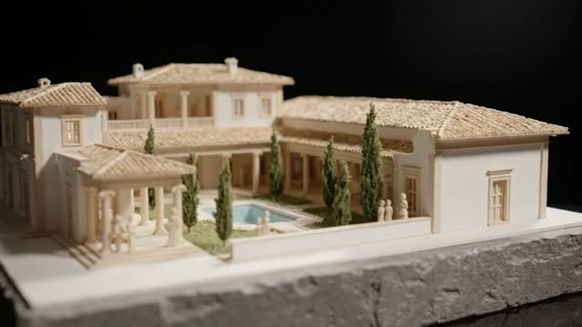
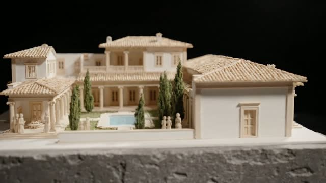
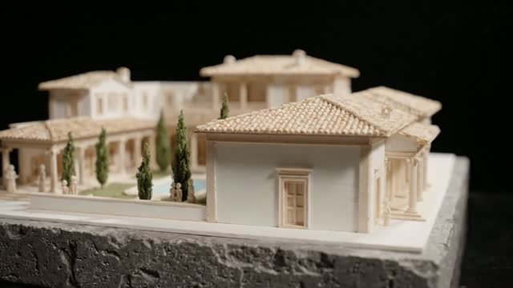
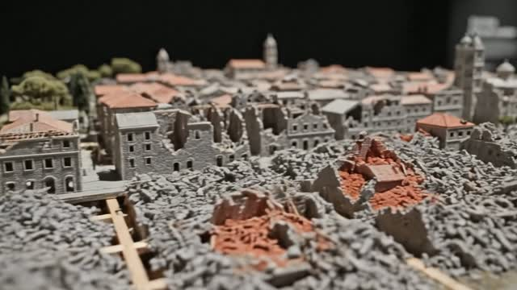

# Maquetas 3D (IA)

Las maquetas son **miniaturas arquitectónicas a escala generadas con IA**: el edificio, la ciudad o el terreno del que habla la narración, construido como una maqueta de museo sobre un pedestal de piedra, con fondo negro y luz de estudio. No son plantillas de Remotion: son planos de vídeo (o imagen) que entran en el montaje como un clip más.

## Cuándo se usan

- Poco: **~2 % de las escenas**.
- **Solo** cuando la narración describe un **objeto físico con volumen**: casa o villa, edificio, palacio, teatro, fortaleza, puente, barco, trazado de una ciudad, terreno o estrecho.
- **Nunca** para números abstractos, personas o emociones. Para eso están los overlays (`stat_big`, `narrative_text`…).

## Cómo se generan

- **Texto → vídeo** con Google Veo (lo lanzamos a través de G-Labs), 8 s por plano. Es la opción preferida porque la cámara se mueve alrededor de la maqueta.
- **Texto → imagen** cuando solo hace falta un fotograma fijo (luego se anima con un Ken Burns suave en el montaje).

## Plantilla de prompt

**Todos** los prompts de maqueta empiezan con esta frase fija:

```
Miniature 3D architectural scale model on a stone pedestal, black void background, soft studio spotlight, tilt-shift, museum model, no text, no labels,
```

y a continuación se añade **la descripción del modelo** (materiales, partes, época) y **su movimiento** (órbita de cámara, derrumbe, corte…).

### De la narración a la maqueta

| Narración | Maqueta |
| --- | --- |
| "la villa romana tenía un patio central" | Villa de yeso blanco y madera, la cámara orbita despacio alrededor. |
| "la casa antisísmica de madera" | Esqueleto de madera de la casa, en corte (cutaway). |
| "la ciudad quedó en ruinas" | Maqueta de la ciudad cuyas manzanas se desmoronan en polvo rojo. |
| "un estrecho de 3 km" | Sección de dos masas de montaña con agua azul oscuro entre ellas. |

### Prompt completo de ejemplo (villa)

```
Miniature 3D architectural scale model on a stone pedestal, black void background, soft studio spotlight, tilt-shift, museum model, no text, no labels. A Roman patrician villa from the 1st century AD built in white plaster and pale wood: central atrium with impluvium pool, peristyle garden with tiny columns and cypress trees, terracotta tiled roofs, one corner cut away to show the rooms inside, tiny wooden figures for scale. Slow cinematic orbit of the camera around the model, shallow depth of field, photorealistic.
```

## Ejemplos

🎬 Vídeo (8 s, 1280×720, sin audio): [`maqueta_villa_romana.mp4`](maqueta_villa_romana.mp4), generado con el prompt de la villa.

Fotogramas de ese mismo plano:

<p>



</p>

Ciudad destruida (terremoto de Messina de 1908, "el 91 % de la ciudad quedó destruida"):


